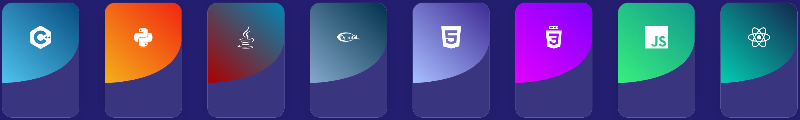
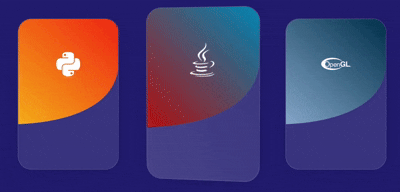

# Tilt Cards

Este proyecto es una aplicación React creada con Vite que muestra tarjetas interactivas con efecto de inclinación (tilt) al pasar el mouse.


## Características

<div style="display: flex; align-items: center; gap: 10px; justify-content: center">    
  <ul>
    <li>Tarjetas con efecto 3D de inclinación.</li>
    <li>Código limpio y modular.</li>
    <li>Configuración mínima usando Vite.</li>
  </ul>
    
</div>

## Instalación

1. Clona el repositorio:
    ```bash
    git clone https://github.com/MeLlamanMeca/React-Projects.git
    cd "React-Projects/01 - Tarjetas Tilteables"
    ```
2. Instala las dependencias:
    ```bash
    npm install
    ```
3. Inicia la aplicación:
    ```bash
    npm run dev
    ```

## Uso

Abre [http://localhost:5173](http://localhost:5173) en tu navegador para ver la aplicación en funcionamiento.

## Personalización

Puedes modificar las tarjetas o el efecto de inclinación editando los componentes en la carpeta `src/components`.

Puedes modificar el contenido y cantidad de las mismas desde el archivo `data/CardsData.js`
