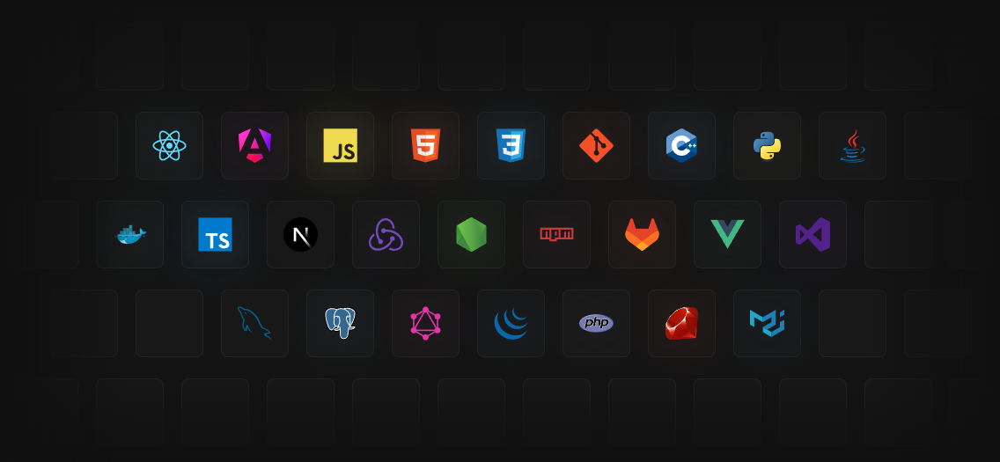

# React Projects Monorepo

Este repositorio es un **monorepo** que agrupa distintos proyectos desarrollados con **React**.

## Tecnologías

- [React](https://react.dev/)
- [Vite](https://vitejs.dev/)

## Proyectos incluidos

### 01. Tilt Cards

Primer proyecto del monorepo. Permite crear tarjetas interactivas que se inclinan al pasar el ratón por encima, ofreciendo una experiencia visual atractiva y dinámica.

#### Librerías utilizadas
- [react-parallax-tilt](https://www.npmjs.com/package/react-parallax-tilt)

---

### 02. Adaptable Grid

Genera una cuadrícula adaptable y personalizable que se ajusta automáticamente al tamaño de la pantalla y al contenido.

#### Librerías utilizadas
- [framer-motion](https://www.framer.com/motion/)

## Herramienta de construcción

Para crear y gestionar los proyectos de este monorepo se utiliza **Vite**. Vite ofrece un entorno de desarrollo rápido, recarga en caliente y una configuración sencilla para aplicaciones React modernas.

Más información: [Vite - Sitio oficial](https://vitejs.dev/)  